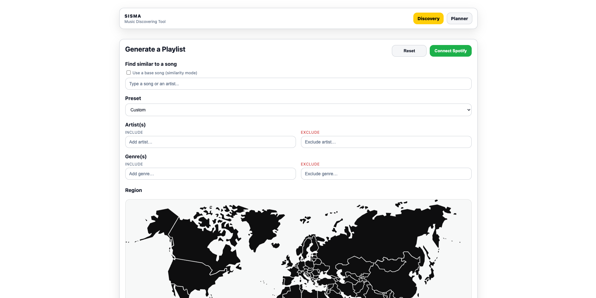
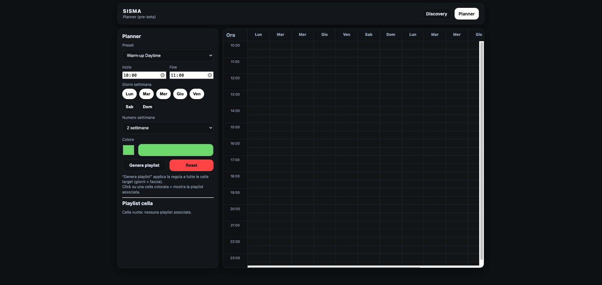

# SISMA -- Music Discovery & Intelligent Playlist Planner

SISMA is a feature-driven music recommendation and scheduling system
designed for commercial environments such as restaurants, cafés, and
hospitality venues.

Instead of relying only on genre labels, SISMA builds playlists using
structured audio features (danceability, energy, BPM, mood, loudness)
combined with rule-based logic and scheduling intelligence.

The system is built around two complementary modules:

-   **Discovery** → intelligent playlist generation\
-   **Planner** → temporal scheduling of playlists across daily/weekly
    grids

The engine integrates hard constraints, soft ranking logic, negative
filters, genre continuity, and artist balancing.

------------------------------------------------------------------------

## Architecture Overview

SISMA separates playlist *generation* from playlist *deployment*.

Discovery answers:\
\> "What should play?"

Planner answers:\
\> "When should it play?"

This separation allows: - controlled experimentation - commercial
environment tuning - future integration with real streaming APIs
(e.g. Spotify)

------------------------------------------------------------------------

## Discovery Module

The Discovery engine generates feature-consistent playlists based on:

-   Audio features (danceability, energy, valence, BPM, loudness)
-   Genre inclusion / exclusion
-   Artist inclusion / exclusion
-   Regional filtering
-   Popularity-aware balancing
-   Hard vs soft constraints
-   Negative filtering logic

### Example UI

### Core Logic

The engine works in progressive filtering steps:

1.  Region / universe selection\
2.  Explicit filtering\
3.  Feature constraints (range-based)\
4.  Genre & artist filtering (positive + negative)\
5.  Popularity balancing\
6.  Artist cap enforcement\
7.  Final ranking

Hard constraints strictly filter.\
Soft constraints affect ranking without collapsing the candidate space.

This makes the system robust even under narrow feature ranges.

------------------------------------------------------------------------

## Planner Module

The Planner is a time-grid scheduling system that allows:

-   Preset-based generation (e.g. Warm-up Daytime)
-   Time-slot definition (start / end)
-   Weekday selection
-   Multi-week scheduling
-   Color-coded blocks
-   Cell-based playlist association

### Example UI

The Planner applies generation rules to selected time blocks and builds
a structured weekly rotation.

This allows:

-   Morning vs evening mood shifts
-   Weekday vs weekend differences
-   Multi-week repetition patterns
-   Controlled genre continuity across time

------------------------------------------------------------------------

## System Design Principles

SISMA is built around practical commercial constraints:

-   Avoid artist overexposure\
-   Avoid genre fragmentation\
-   Maintain energy flow continuity\
-   Allow regional coherence\
-   Support discovery without randomness

The system is deterministic but flexible.

------------------------------------------------------------------------

## Tech Stack

Backend: - Python\
- Flask\
- Pandas / NumPy

Frontend: - Vanilla JavaScript\
- HTML / CSS

Data: - Spotify-style audio features dataset\
- Preprocessed genre clustering logic

------------------------------------------------------------------------

## Current Status

Active development 🚧

Recently implemented: - Dual-range feature sliders\
- Region-aware filtering\
- Negative genre filters\
- Artist cap enforcement\
- Planner multi-week scheduling

Planned: - Improved genre expansion logic\
- Better cluster-level genre propagation\
- UI feedback during playlist generation\
- Advanced Planner intelligence layer

------------------------------------------------------------------------

## Project Vision

SISMA is not just a playlist generator.

It is a structured music programming system for real-world environments.

Long term, it can evolve into:

-   A commercial SaaS tool for hospitality\
-   A revenue-optimization music engine\
-   An AI-assisted environment-aware sound design platform
