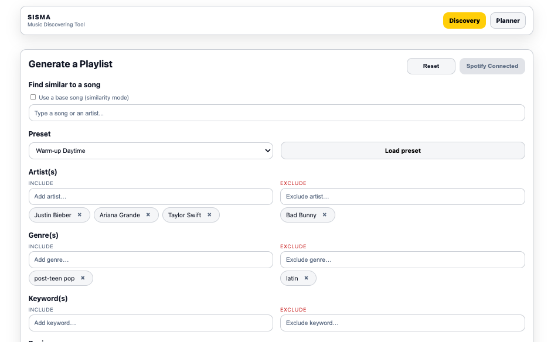
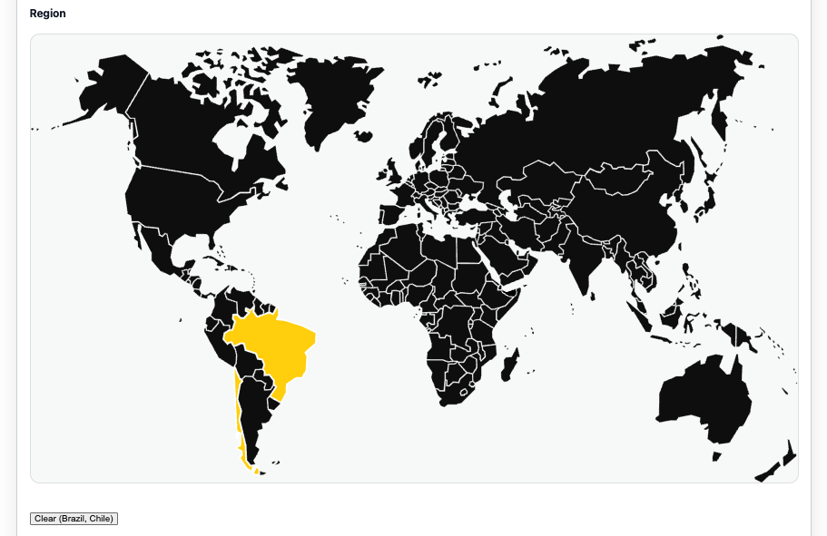
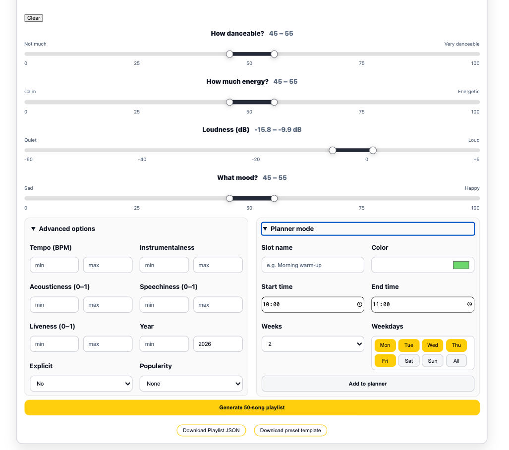
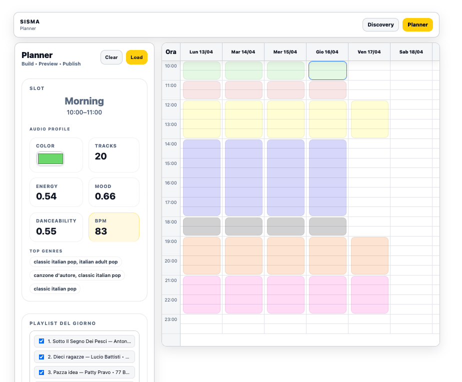
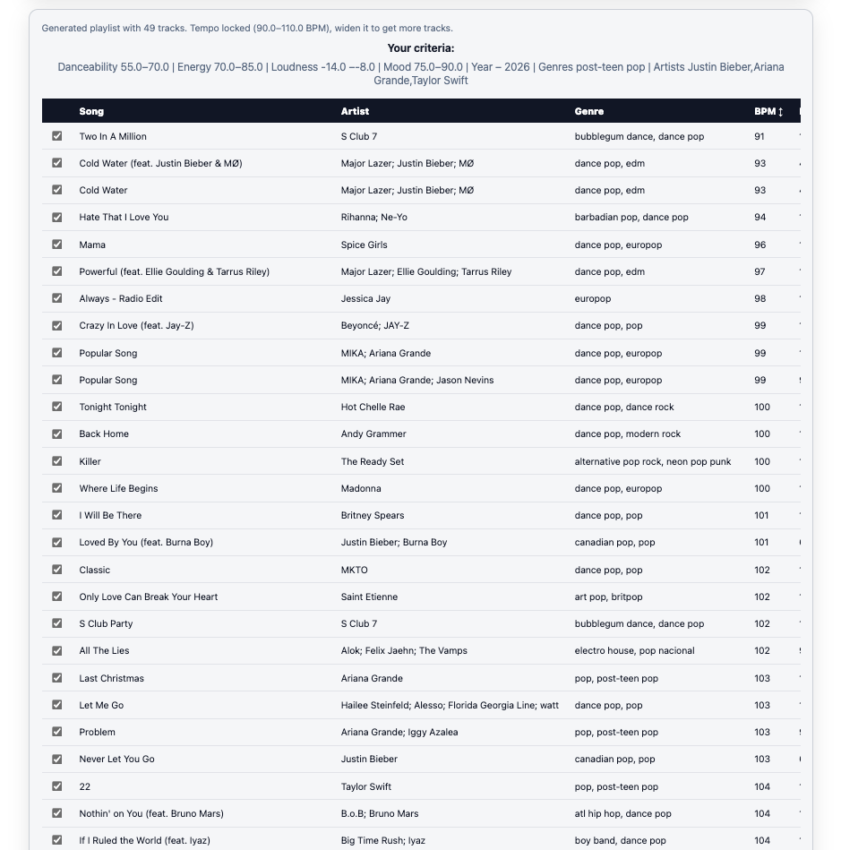

# 🎧 SISMA — Shaping Musical Experience Over Time

SISMA is a system for **designing and controlling how music is perceived over time**.

Rather than simply recommending songs, it constructs **structured musical sequences** that guide the listener through controlled variations of:

- energy ⚡  
- mood 🎭  
- tempo 🕒  
- familiarity 🔁  

---

## 💡 Core Idea

Music does not only influence how we feel.

It also influences **how we perceive time**.

In everyday environments such as restaurants, cafés, or retail spaces, music can make time feel:

- faster ⏩  
- slower ⏳  
- more engaging 🎧  
- or almost unnoticeable  

This suggests that musical structure is not neutral — it actively shapes perception.

---

SISMA explores this idea computationally:

> **How can we design sequences of music that influence the listener’s perception of time?**

Instead of isolated playlists, SISMA builds:

> 🎼 **controlled musical trajectories over time**

by balancing:

- continuity vs variation  
- repetition vs novelty  
- stability vs exploration  

---

## 🧠 System Overview

SISMA is composed of two complementary modules:

- 🔍 **Discovery** → *What should play?*  
- 🗓️ **Planner** → *When should it play?*  

---

# 🔍 Discovery — Modeling Musical Space

  
*Constraint-based interface for defining the musical search space (artists, genres, filters).*

  
*Geographical filtering of the musical space, allowing region-specific cultural constraints.*

  
*Continuous control of musical features such as energy, mood, tempo, and loudness.*

---

The Discovery module generates playlists by navigating a **multi-dimensional feature space**, rather than relying only on genre labels.

### ⚙️ Inputs
- audio features (energy, BPM, valence, danceability)  
- artist inclusion / exclusion  
- genre inclusion / exclusion  
- keyword filtering  
- popularity constraints  
- optional regional filtering  

---

### 🧠 Generation Pipeline

Constraints → Universe → Pool → Ranking → Selection

---

### 🔬 Key Idea

Discovery treats playlist generation as:

> **a constrained optimization problem in musical feature space**

---

# 🗓️ Planner — Structuring Music in Time

  
*Weekly scheduling of music with controlled variation and no repetition across days.*

---

The Planner transforms playlists into **time-dependent musical programs**.

### ⚙️ What it does
- defines time slots (e.g. lunch, dinner, evening)  
- assigns musical profiles (presets)  
- generates distinct playlists per day  
- controls repetition and variation  

---

### 🚫 Constraints

- ❌ no track repetition within a slot  
- 👤 max 2 tracks per artist per day  
- ⚖️ balanced exposure across days  

---

## 📊 Example Output

  
*Generated playlist with feature consistency and controlled ordering.*

---

# 🍽️ Example Applications

- 🍽️ **Restaurants** → slower, immersive experience  
- 🛒 **Retail** → faster, engaging flow  
- ☕ **Cafés** → balanced atmosphere  

---

# 🧠 Why this matters

SISMA reframes playlist generation as:

> **a problem of shaping perception through time**

---

# 🧰 Tech Stack

Python • Flask • Pandas • JS

---

# 🚀 Vision

SISMA is a system for:

> 🎼 **designing musical environments over time**
